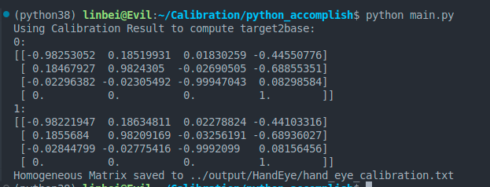
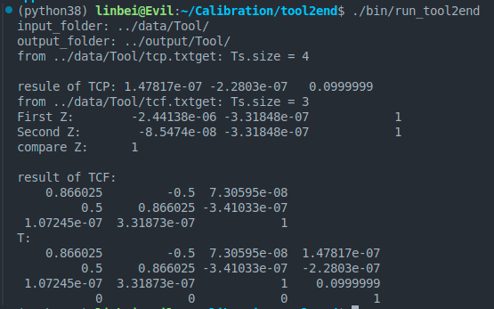
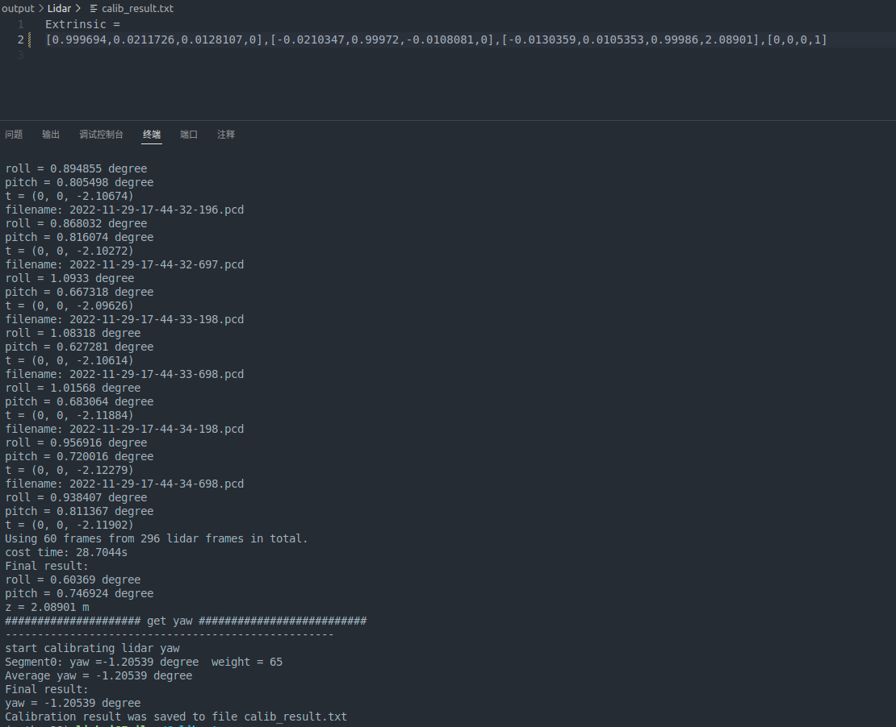

# 两轮差速机器人+6轴机械臂的标定

* 手眼标定（眼在手上，双目相机到最后一关节的标定）

* 工具标定（执行器到最后一关节的标定）

* 激光雷达标定（雷达到小车中心的标定）

### 手眼标定
[https://blog.csdn.net/weixin_45844515/article/details/125571550]

[https://blog.csdn.net/hellohake/article/details/104808149]

参考上述帖子，使用opencv中的cv2.calibrateHandEye()作手眼标定
实现见代码：python_accomplish中的Hand_Eye.py

### 工具标定
[https://blog.csdn.net/qq_41658212/article/details/105686309]

参考该帖，可以对工具进行六点法标定。

实现见代码tool2end 或者 python_accomplish中的Tool_calibration.py

### 激光雷达标定
[https://blog.csdn.net/Walking_roll/article/details/133611662]

参考论文：Yan G, Luo Z, Liu Z, et al. SensorX2car: Sensors-to-car calibration for autonomous driving in road scenarios[J]. arXiv preprint arXiv:2301.07279, 2023.

参考代码：https://github.com/PJLab-ADG/SensorsCalibration/tree/master/SensorX2car/lidar2car

实现见代码：lidar2car，实现了雷达到小车中心的标定。

Tips：lidar2car仅标定了：Lidar到地面的Height和Lidar到小车中心的旋转矩阵，x，y须另外的方法。

[new idea]:

小车沿直线行驶，仅需要垂直墙面（或者标定板垂直悬挂？无需地面），点云数据。
这里，使用两个不共面的垂直平面(两个垂直悬挂的标定板？)，分别计算法向量，叉乘得到地面法向量

1、点云中提取墙面->拟合墙面法向量->得到地面法向量->计算pitch和roll

2、小车直线运动，Lidar和Car之间的yaw始终不变；相邻两帧的点云使用ICP对齐->得到两帧点云间的T，提取x_i，y_i，yaw_i,